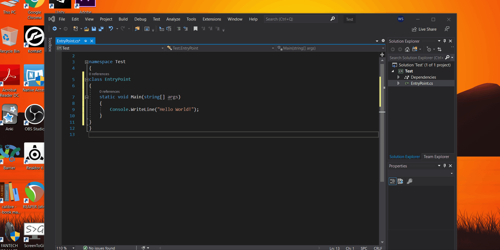
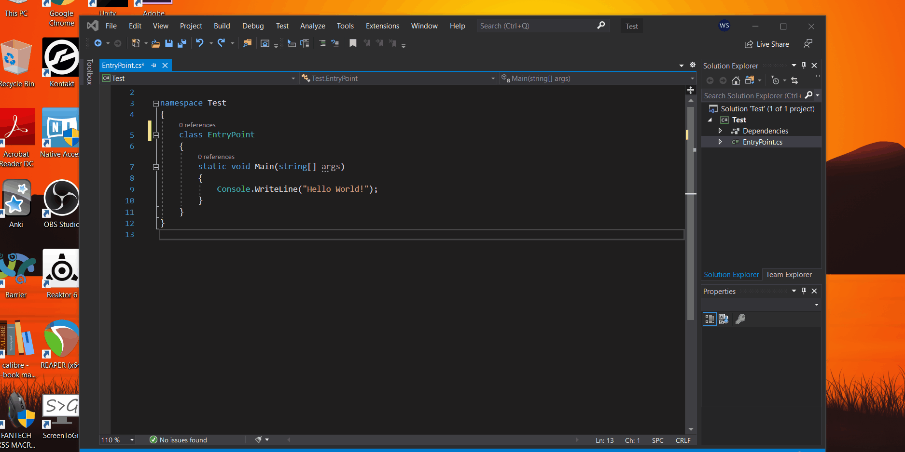

# Creating a New Project in Visual Studio
## Shortcut to run your project in Visual Studio
#### Ctrl+F5 or You can do as shown below:

## Shortcut to bring selected code to one tab space to the left
#### Shift+Tab

