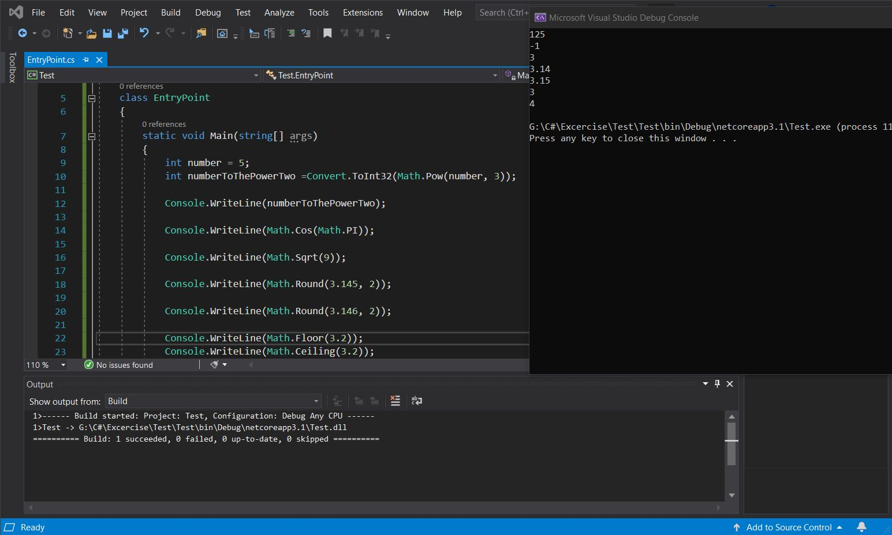

# Perform Math Operations
## Using the Math class to perform different math operation
#### As you can see Math is a class of system namespace and you can do whole lot of things like power,use constant like PI,square root, round,floor,ceiling etc. 
#### Notice we need to convert the Math.Pow to integer data type using the Convert class because Math.Pow always returns a double data type value.

