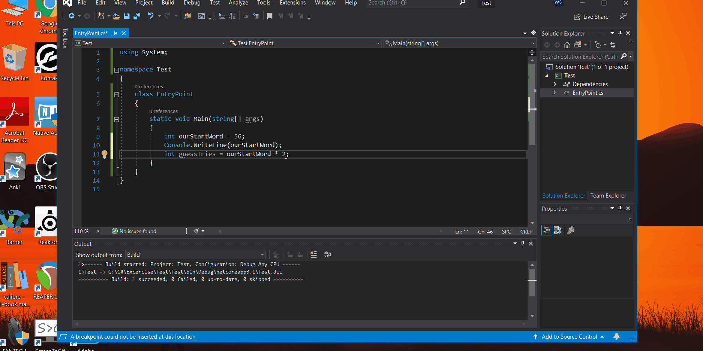

# Quality Code
## Variable Name Format in C#
#### You should always write your variable names in camelCode. Example is below.

## Curly Brackets { } position in C# Language
#### Unlike Java, The curly Brackets should always be in a new row as shown below: 
#### Just a format option not a must.

## Magicial Numbers and Why you should avoid it
#### A magical number is a stray number in code used directly without assigning it to a variable like shown below.
#### You should never use it because they are hard to debug and often hard to find them. To avoid it you should assign it to a variable.

