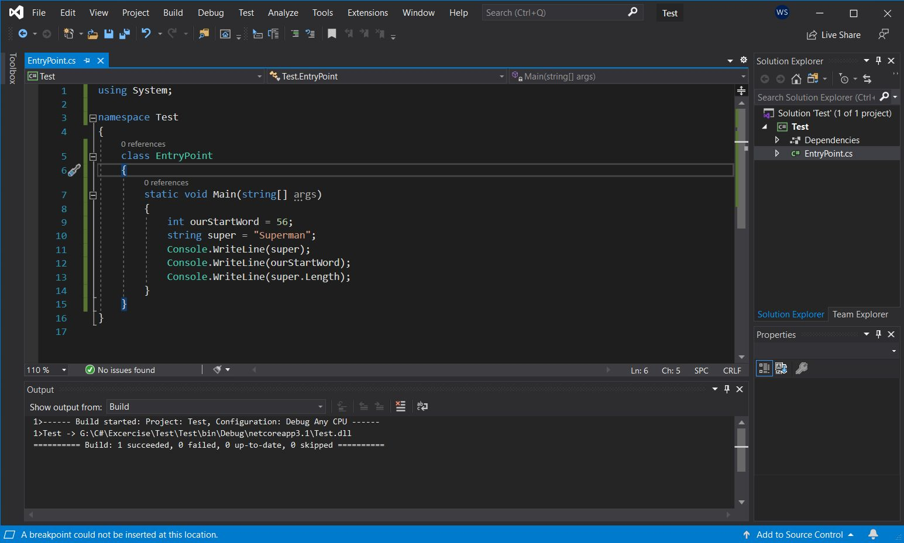

# Quality Code
## Variable Name Format in C#
#### You should always write your variable names in camelCode. Example is below.

## Curly Brackets { } position in C# Language
#### Unlike Java, The curly Brackets should always be in a new row as shown below: 
#### Just a format option not a must.

