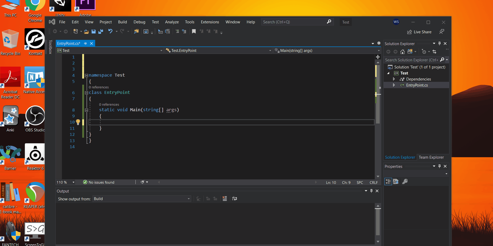

# Say Hello to the World
## Adding a ```using namespace;``` related to the class directly if the namespace is not written in code in Visual Studio
#### Two ways one through shortcut and another hovering over the class word. You see Visual Studio even adds the namespace automatically for you.
#### Shorcut: Ctrl+. and then Enter


## Icons that helps to differentiate method and properties in Visual Studio in the drop down menu of Code
#### The wrench icon represent properties and box icon represent methods.
#### Methods are functions. Properties are variable with values or fields.


