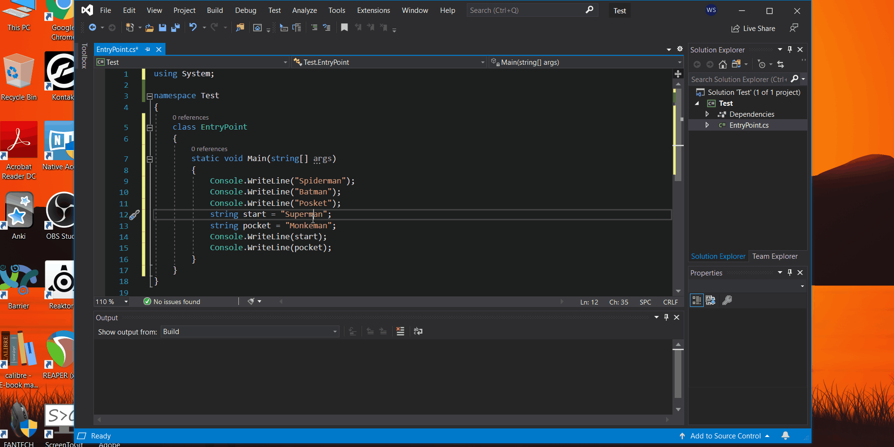
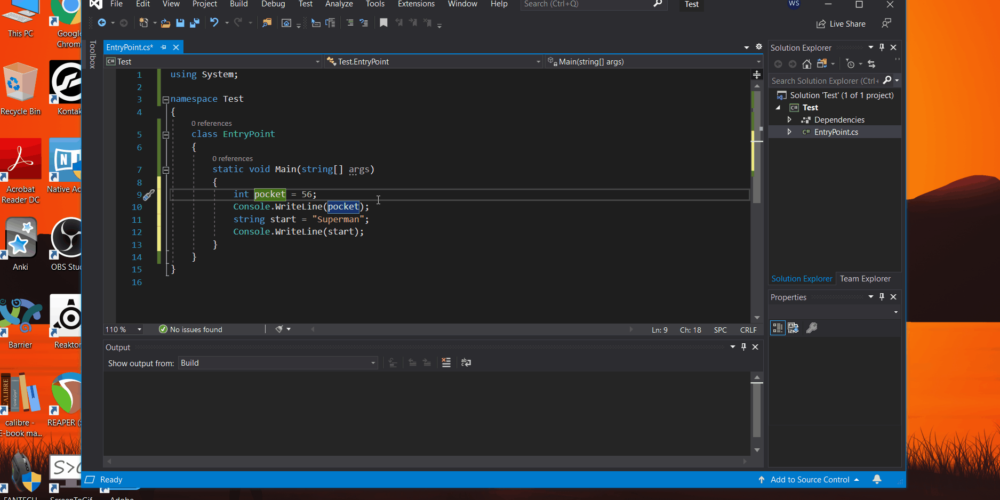

# Useful Shortcuts That You Need to Know in Visual Studio
## Shortcut to select specific part of your code like rectangles and sqaure or any dimension
#### Alt+Left click and drag. You can change the code in all the rows at once after selecting them as shown below.

## No need to select a single row to copy it
#### You can directly place the cursor anywhere on the row you want to copy and hit Ctrl+C and Paste it anywhere you like.

## Shortcut to jump to single words instead of single character at a time while using arrow keys
#### Ctrl+left or right arrow keys.

## Keyboard only shorcut to select multiple lines of code in desired dimension like square or rectangle
#### Alt+Shift+Arrow keys up or down

## Shortcut to comment out and uncomment the selected rows of code
#### Ctrl+K+C and Ctrl+K+U (Keep on holding control until you place C or U) 
#### Hold Ctrl. Press K and let go of K. Press C without letting go of Ctrl or you can tap control twice like this Ctrl+K Ctrl+C.

